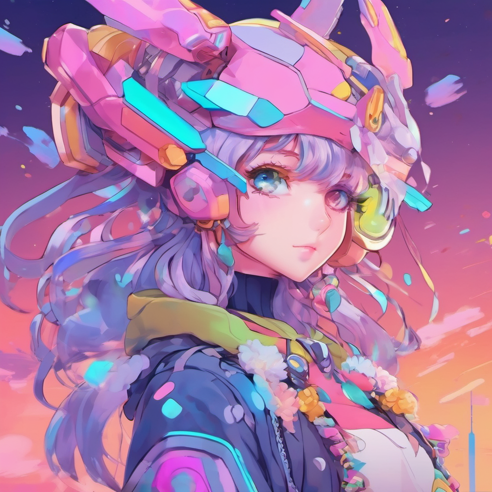

<div align="center">

# Luna

<div>
    
</div>
<h2>GitHub Luna Stats</h2>

[](https://github.com/fuad-daoud/discord-ai/actions/workflows/workflow.yml)
[](https://github.com/fuad-daoud/discord-ai/actions/workflows/workflow.yml)
[](https://github.com/fuad-daoud/discord-ai/actions/workflows/workflow.yml)

**powered by augment generative AI**
<div style="display: flex; justify-content: space-around;">


</div>
</div>


docker container `ubuntu:22.04`

install go v1.2.0 in ubuntu

logged in as `root`

```bash
apt update
wget https://go.dev/dl/go1.21.0.linux-amd64.tar.gz
tar -xvf go1.21.0.linux-amd64.tar.gz
mv go /usr/local
export GOROOT=/usr/local/go
export GOPATH=$HOME/go
export PATH=$GOPATH/bin:$GOROOT/bin:$PATH
source ~/.profile
go version
```

logged in as `non root`

```bash
sudo apt update
wget https://go.dev/dl/go1.21.0.linux-amd64.tar.gz
sudo tar -xvf go1.21.0.linux-amd64.tar.gz
sudo mv go /usr/local
export GOROOT=/usr/local/go
export GOPATH=$HOME/go
export PATH=$GOPATH/bin:$GOROOT/bin:$PATH
source ~/.profile
go version
```

need these packages to use the voice from respeecher

```bash
apt install ffmpeg
```

export tokens

```bash
export TOKEN="MTI1MzI4NjI0MzY4NTYzMDAyNA.G6aw13.X4Vg9L9BfRWkNJcVgSbcLnqe_GbKoydkhJ9krw"
export DEEPGRAM_API_KEY="b3e84a4a52bf9a59b9be90b1fe40af900adaef52"
export OPENAI_API_KEY="sk-proj-AsgPdFnfbcgSNTBdZivIT3BlbkFJPVWizOOQqwPygX2ctH78"
export RESPEECHER_API_KEY="DgB1A7jQlUBPEbKjH490bg"
```

<div style="display: inline-block; justify-content: space-around	;">

<br>

[](https://github.com/fuad-daoud/github-readme-stats)

</div>
