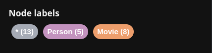
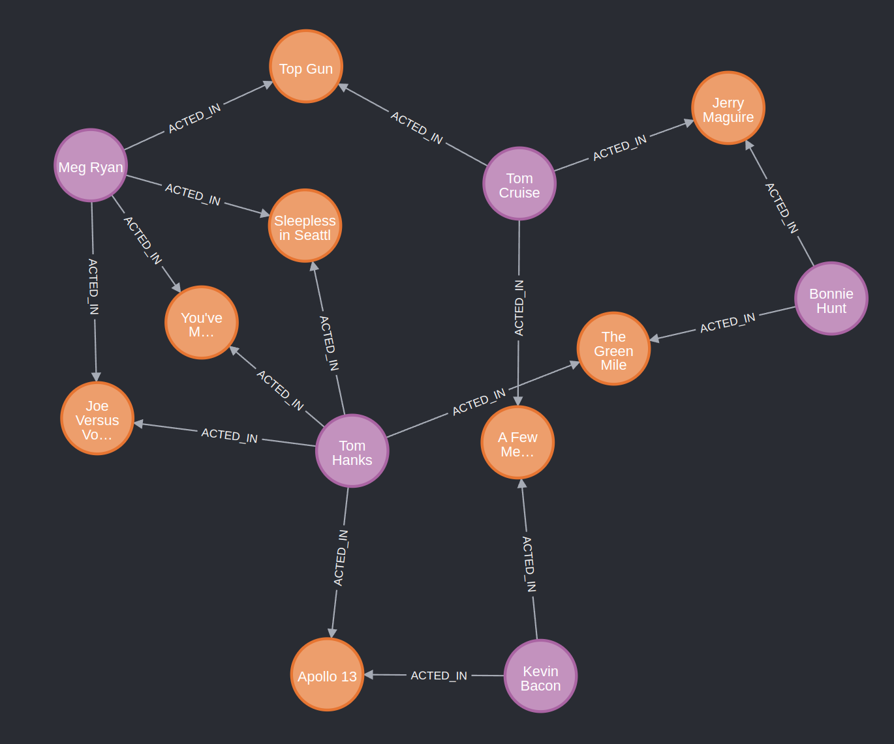

# Neo4j Aura

for local development database use the below docker image from https://hub.docker.com/_/neo4j

```bash
docker run --detach --publish=7474:7474 --publish=7687:7687 --volume=./neo4j/data:/data --env=NEO4J_AUTH=none --network="host" --name neo4discord-bridged neo4j
```

## Movie Graph Guide

### Sample data

Create the movie graph

Use the scripts in [movies.cql](assets/movies.cql) to create the movie graph. It contains a single Cypher query statement
composed of multiple `CREATE` clauses.

**_NOTE: This guide assumes that you use an empty graph. If it contains data, see page 9 on how to clean it up._**

### Create constraints

**_Unique node property constraints_**

Create unique node property constraints to ensure that property values are unique for all nodes with a specific label.
Adding the unique constraint, implicitly adds an index on that property.

```cql
CREATE CONSTRAINT FOR (n:Movie) REQUIRE (n.title) IS UNIQUE
CREATE CONSTRAINT FOR (n:Person) REQUIRE (n.name) IS UNIQUE
```

### Index nodes

Create indexes on one or more properties for all nodes that have a given label. Indexes are used to increase search
performance.

```cql
CREATE INDEX FOR (m:Movie) ON (m.released)
```

### Find

**_Find individual nodes_**

1. Run any of the following query examples.
2. Notice the syntax pattern.
3. Try looking for other movies or actors.

* Find the actor named "Tom Hanks":  
  `MATCH (tom:Person {name: "Tom Hanks"}) RETURN tom`
* Find the movie with title "Cloud Atlas":  
  `MATCH (cloudAtlas:Movie {title: "Cloud Atlas"}) RETURN cloudAtlas`
* Find 10 people and return their names:  
  `MATCH (people:Person) RETURN people.name LIMIT 10`
* Find movies released in the 1990s and return their titles.  
  `MATCH (nineties:Movie) WHERE nineties.released >= 1990 AND nineties.released < 2000 RETURN nineties.title`

### Query

**_Find patterns_**

Use the type of the relationship to find patterns within the graph, for example, `ACTED_IN` or `DIRECTED`. What other
relationships exist?

* What movies did Tom Hanks act in?  
  `MATCH (tom:Person {name: "Tom Hanks"})-[:ACTED_IN]->(tomHanksMovies) RETURN tom,tomHanksMovies`
* Who directed "Cloud Atlas"?  
  `MATCH (cloudAtlas:Movie {title: "Cloud Atlas"})<-[:DIRECTED]-(directors) RETURN directors.name`
* Who were Tom Hanks' co-actors?  
  `MATCH (tom:Person {name:"Tom Hanks"})-[:ACTED_IN]->(m)<-[:ACTED_IN]-(coActors) RETURN DISTINCT coActors.name`
* How people are related to "Cloud Atlas"?  
  `MATCH (people:Person)-[relatedTo]-(:Movie {title: "Cloud Atlas"}) RETURN people.name, Type(relatedTo), relatedTo.roles`

### Solve

**_Six Degrees of Kevin Bacon_**

You might have heard of the classic "Six Degrees of Kevin Bacon". That is simply the shortest path between two nodes,
called the "Bacon Path".

* Use variable length patterns to find movies and actors up to 4 "hops" away from Kevin Bacon.  
  `MATCH (bacon:Person {name:"Kevin Bacon"})-[*1..4]-(hollywood) RETURN DISTINCT hollywood`
* Use the built-in shortestPath() algorithm to find the "Bacon Path" to Meg Ryan.

```cql
  MATCH p=shortestPath(
  (bacon:Person {name:"Kevin Bacon"})-[*]-(meg:Person {name:"Meg Ryan"})
  )
  RETURN p
 ```

### Recommend

**_Recommend new co-actors_**

Let's recommend new co-actors for Tom Hanks. A basic recommendation approach is to find connections past an immediate
neighborhood that are themselves well connected.

For Tom Hanks, that means:

1. Extend Tom Hanks co-actors to find co-co-actors who have nоt worked with Tom Hanks.
```
MATCH (tom:Person {name:"Tom Hanks"})-[:ACTED_IN]->(m)<-[:ACTED_IN]-(coActors),
    (coActors)-[:ACTED_IN]->(m2)<-[:ACTED_IN]-(cocoActors)
  WHERE NOT (tom)-[:ACTED_IN]->()<-[:ACTED_IN]-(cocoActors) AND tom <> cocoActors
  RETURN cocoActors.name AS Recommended, count(*) AS Strength ORDER BY Strength DESC
```

results should look like this

| Recommended       | 	Strength |
|-------------------|-----------|
| **Tom Cruise**	       | 5         |
| Zach Grenier	     | 5         |
| Cuba Gooding Jr.	 | 4         |
| Keanu Reeves	     | 4         |

more rows ...

2. Find someone who can introduce Tom Hanks to his potential co-actor, in this case Tom Cruise.
```cql
MATCH (tom:Person {name:"Tom Hanks"})-[:ACTED_IN]->(m)<-[:ACTED_IN]-(coActors),
  (coActors)-[:ACTED_IN]->(m2)<-[:ACTED_IN]-(cruise:Person {name:"Tom Cruise"})
RETURN tom, m, coActors, m2, cruise 
```
Node labels





### Clean up
**_Remove the movie data set_**

When you are done experimenting, you can clean up your graph.

**_NOTE: Nodes cannot be deleted if they have relationships, so you need to detach the nodes to delete them._**

1. Delete all Movie and Person nodes, and their relationships.  
`MATCH (n) DETACH DELETE n`  
should return: **Deleted 171 nodes, deleted 253 relationships, completed after 15 ms**
2. Verify that the Movie Graph has been removed.  
`MATCH (n) RETURN n`  
should return: **(no changes, no records)**

   


learn neo4j
https://graphacademy.neo4j.com/courses/modeling-fundamentals/1-getting-started/

learn neo4j for go
https://graphacademy.neo4j.com/courses/app-go/


arrows app is great 

https://arrows.app/